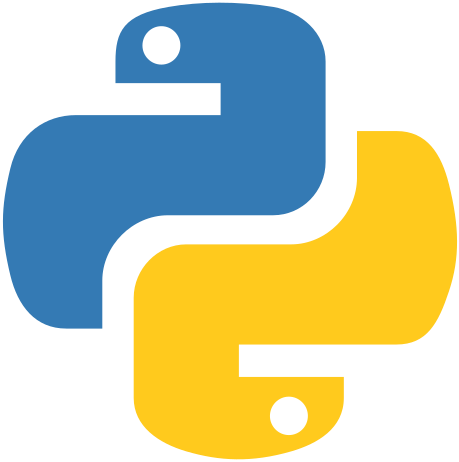

<!-- README.md -->

#  Lexxeous's Python Design Patterns: 

## Summary:

> Credit goes to Dmitri Nesteruk and his [Python Design Patterns course](https://udemy.com/course/design-patterns-python/learn/) on Udemy. The following are links to more of Dmitri's social media and digital resources: 

The design patterns presented here are related to a book called [Design Patterns: Elements of Reusable Object-Oriented Software](https://books.google.com/books/about/Design_Patterns.html?id=6oHuKQe3TjQC) (AKA The "Gang of Four" Book), written by *Erich Gamma*, *Richard Helm*, *Ralph Johnson*, & *John Vlissides*. This book was written in 1994 and was purposed towards languages like **Smalltalk** and **C++**, but are also applicable to other OOP languages such as **C#**, **Java**, **Python**, etc. Design patterns are universally relevant; they are just as important today as they were back in 1994. Some OOP languages have even internalized some design patterns into the language itself, forcing its users to abide by them as part of the language's syntax and program construction. This is seen, for example, in **C#**'s implementation of the observer pattern and **Python**'s implementation of decorators.

> You can download a PDF copy of the aforementioned book [here](http://www.uml.org.cn/c%2B%2B/pdf/DesignPatterns.pdf).

> Run the subsequent scripts with **Python** 3.

## The Solid Design Principles:

### Single Responsibility Principle (SRP) or Separation of Concerns (SOC):

> Each object/class should only take on a single responsibility, without the inclusion of extraneous functionality that is not relevant to said object/class. A class should only have one reason to change. Different classes should handle different, independent tasks/problems.

### Open-Closed Principle (OCP):

> Objects/classes should be open to extension, but closed to modification? Once a section of code is working properly, you should not "go back" and change/modify the code to add functionality, but rather create new or inherit objects/classes/methods to extend the current functionality.

### Liskov Substitution Principle (LSP):

> If a base class implements an abstract base class, any child class that is derived/inherited from the base class should also implement said abstract base class. You should always be able to substitute a base type for a sub-type.

### Interface Segregation Principle (ISP):

> Interface classes should not attempt to implement more methods than necessary. Don't put too much into a single interface; split/abstract into separate interfaces. Practice YAGNI: You Ain't Gunna Need It.

### Dependency Inversion Principle (DIP):

> High-level classes/modules should not directly depend on low-level modules, but should instead depend on low-level abstractions. This principle does not directly relate to dependency injection; do not confuse the two different concepts.

## Design Principle Categories:

| Creational | Structural |  Behavioral             |
|:----------:|:----------:|:-----------------------:|
| Builder    | Adapter    | Chain of Responsibility |
| Factories  | Bridge     | Command                 |
| Prototype  | Composite  | Interpreter             |
| Singleton  | Decorator  | Iterator                |
|            | Façade     | Mediator                |
|            | Flyweight  | Memento                 |
|            | Proxy      | Observer                |
|            |            | State                   |
|            |            | Strategy                |
|            |            | Template Method         |
|            |            | Visitor                 |

## Creational:

### Builder:

> When piecewise object construction is complicated, provide an API for doing it succinctly.

  * A builder is a separate component for building an object.
  * Can either give builder an initializer or return it via a static function.
  * To make builder fluent, make all methods `return self`.
  * Different facets of an object can be built with different builders working in tandem via a base class.

### Factories:

> A component is responsible solely for the wholesale (not piecewise) creation of objects.

  * A factory method is a typically a static method that creates objects.
  * A factory is any entity that can take care of object creation.
  * A factory can be external or reside inside the object as an inner class.
  * Hierarchies of factories can be used to create related objects.

### Prototype:

> A partially or fully initialized object that you copy (clone) and make use of.

  * To implement a prototype, partially construct an object and store it somewhere.
  * Deep copy the prototype.
  * Customize the resulting instance.
  * Use a factory to provide a convenient API for using the prototypes.

### Singleton:

> A component which is instantiated only once.

  * Different realizations of Singleton: Allocator, Decorator, Metaclass.
  * Laziness is easy, just initialize on the first object creation request.
  * Monostate variation works well for static content/data.
  * There are testability issues that arise when attempting to retain only a single instance of dynamic data structures.

> Crowd's least favorite, some think that it should be removed as a valid design pattern; GoF believe that it is almost always a design smell.

## Structural:

### Adapter:

> A construct which adapts an existing interface, X, to conform to the required interface, Y.

  * Determine the API that you have and the API that you need.
  * Create an adapter component which aggregates (has a reference to, ...) the adaptee.
  * Create a set of steps that converts the adapter's data/structures to the adaptee's data/structures.
  * Intermediate representations can pile up for complex conversions; use caching and other optimizations to lessen computational strain.

### Bridge:

> A mechanism that decouples an interface from an implementation (typically modeled in a hierarchical fashion).

  * Removes direct dependency between the abstraction and the implementation.
  * Both the abstraction and the implementation can exist as hierarchies.
  * The Bridge design pattern represents a stronger form of encapsulation.
  * Strongly violates the OCP, but that is the price you pay for flexibility when merging hierarchies.

> Bridge prevents "Cartesian product" and entity complexity explosion(s).

### Composite:

> A mechanism for treating individual (scalar) objects and compositions of objects in a uniform manner.

  * Objects can use other objects via inheritance and/or composition.
  * Some composed and singular objects need similar/identical behaviors and methods.
  * The composite design pattern lets us treat both types of objects as if there were little to no difference between them.
  * A single object in **Python** can make itself iterable by yielding `self` from `__iter__()`, supported by `Iterable` and `ABC`.

### Decorator:

> Facilitates the addition of behaviors to individual objects without inheriting from them.

  * Keeps the reference to the decorated object(s).
  * Adds utility attributes and/or methods to augment the object('s) features.
  * May or may not forward calls to the underlying object(s).
  * Proxying of underlying calls can be done dynamically.
  * **Python**'s functional decorators create a wrapper around functions; no direct relation to the GoF Decorator design pattern.

### Façade:

> Provides a simple, easy to understand user interface over a large and sophisticated body of code.

  * Provide a simplified API over a set of classes.
  * May wish to (optionally) expose internals and/or low-level methods through the facade.
  * May allow users to "escalate" to use more complex APIs if they need to.

### Flyweight:

> A space optimization technique that lets us use less memory by storing externally the data associated with similar objects.

  * Store common data externally.
  * Specify an index or a reference into the external data store.
  * Define the concept of "ranges" on homogeneous collections and store data related to those ranges.

### Proxy:

> A class that functions as an interface to a particular resource. That resource may be remote, expensive to construct or may require logging or some other added functionality.

  * Has the same interface as the underlying object.
  * To create a proxy, simply replicate the existing interface of an object.
  * Add relevant functionality to the redefined member functions.
  * Different proxies (communication, logging, caching, etc.) have completely different behaviors.

## Behavioral:

### Chain of Responsibility:

> A chain of components that all get a chance to process a command or query, optionally having default processing implementation and an ability to terminate the processing chain.

  * Chain of Responsibility can be implemented as a chain of references or a centralized construct.
  * Enlist objects in the chain possibly controlling their order.
  * Object removal from chain in the `__exit__()` method.
  * 

### Command:

> An object which represents an instruction to perform a particular action. Contains all of the information necessary for the action to be taken.

  * Encapsulate all details of an operation in a separate object.
  * Define instruction for applying the command (wither in the command, or elsewhere).
  * Optionally define instructions for undoing the command.
  * Can create composite commands (a.k.a macros).

### Interpreter:

> A component that processes structured text data. Does so by turning text data into separate lexical tokens (lexing) and then interpreting sequences of said tokens (parsing).

  * Barring simple cases, interpreters act in two stages: lexing and parsing.
  * Lexing turns text into a set of tokens: `INTERGER`, `PLUS`, `MINUS`, `LPAREN`, `RPAREN`, etc...
  * Parsing turns tokens into meaningful constructs that can be evaluated.
  * Parsed data then can be traversed and an answer can be given out the end.

### Iterator:

> An object that facilitates the traversal of a data structure.

  * Specifies how you can traverse an object.
  * Stateful iterators cannot be recursive.
  * The `yield` keyword allows for much more succinct iteration.
  * We can use `__iter__()`, `__next__()`, `raise StopIteration` to our advantage.

### Mediator:

> A central component that facilitates communication between other components without them necessarily being aware of each other or having direct (reference) access to each other.

  * Create the mediator and have each object in the system refer to it.
  * Mediator engages in bidirectional communication with its connected components.
  * Mediator has functions that the components can call.
  * Components have functions that the mediator can call.
  * Event processing (e.g., Rx) libraries can make communication even easier to implement.

### Memento:

> A token/handle class that represents the system state at every point in time. Lets us roll back to the state when the token was generated. May or may not directly expose state information.

  * Mementos are used to roll back states arbitrarily.
  * A memento is simply a token/handle class with (typically) no functions of its own.
  * A memento is not required to expose directly the state(s) to which it reverts the system.
  * Can be used to implement undo/redo functionality as well.

### Observer:

> An observer is an object that wishes to be informed about events happening in the system. The entity generating the events is an observable.

  * Observer is an intrusive approach: an observable must provide an even to subscribe to.
  * Subscription and un-subscription is handled with appending and removing items from a list.
  * Property notifications are easy; dependent property notifications are a bit more involved.

### State:

> A pattern in which the object's behavior is determined by its state. An object transitions from one state to another (something needs to trigger transition). A formalized construct which manages state and transitions is called a (finite) state machine.

  * Given sufficient complexity, it pays to formally define possible states and events/triggers.
  * Can define: state entry/exit behaviors, event transition action(s), guard conditions enabling/disabling a transition, & default action(s) when no transitions are found for an event.

### Strategy:

> Enables the exact behavior of a system to be selected at run time.

  * Define an algorithm at a high level.
  * Define the interface you expect each strategy to follow.
  * Provide for dynamic composition of strategies in the resulting object.

### Template Method:

> Allows us to define the "skeleton" of the algorithm with concrete implementations defined in sub-classes.

  * Define an algorithm at a high level in a parent class.
  * Define the constituent parts as abstract methods/properties.
  * Inherit the algorithmic parent class and provide necessary overrides for methods/properties.

### Visitor:

> A component (visitor) that knows how to traverse a data structure composed of (possibly related) types.

  * OOP double/multiple-dispatch approach is not necessary in **Python**.
  * Make a custom decorator (visitor), decorating each "overloaded" method with `@visitor`.
  * Call `visit()` and the entire structure gets traversed.